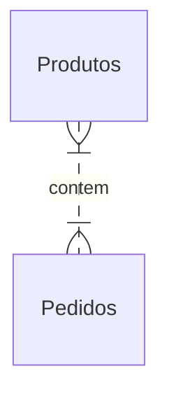
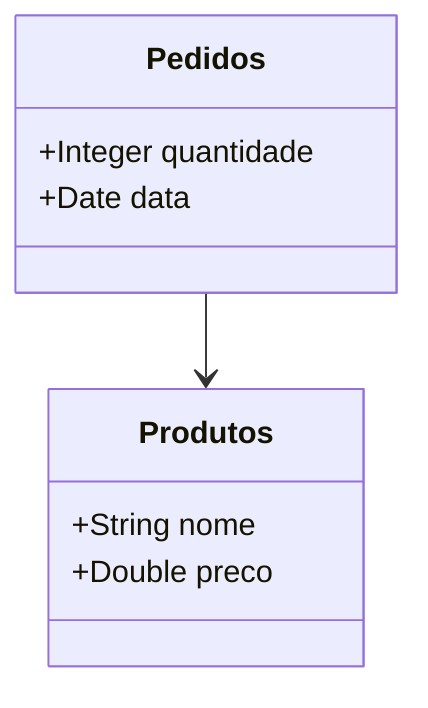

# Coleções utilizadas para entendimento do tópico

Vamos trabalhar com um caso hipotético, tal como exposto no diagrama a seguir:

```mermaid
erDiagram
    Produtos }|..|{ Pedidos : contem
```

```mermaid
classDiagram
    Pedidos --> Produtos
    class Produtos{
        +String nome
        +Double preco
    }
    class Pedidos{
        +Integer quantidade
        +Date data
    }
```