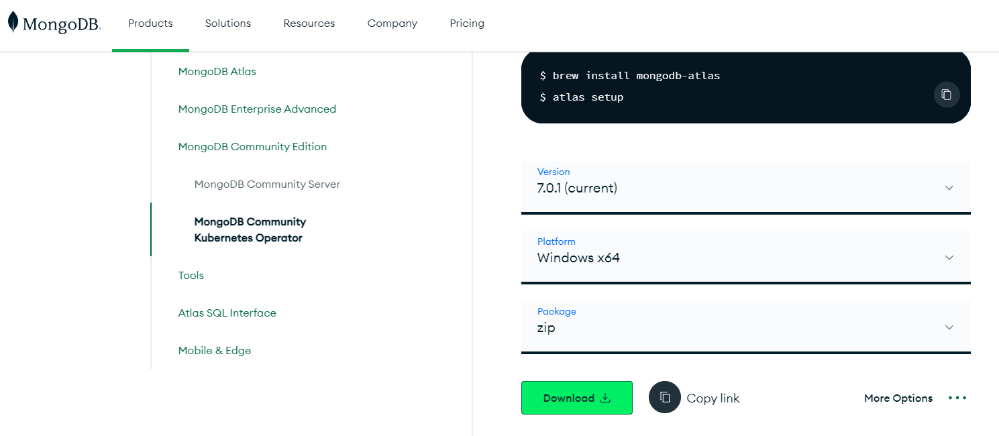

# Processo de instalação em ambiente Windows

Para realizar a instalação do MongoDB no nosso ambiente, precisamos acessar o navegador, procurar por "**mongodb download**" e acessar o link [MongoDB Community Download](https://www.mongodb.com/try/download/community).

## Instalação do MongoDB Community Server

Em virtude do cenário restrito (execução sem usuário privilegiado), é preciso fazer a configuração de forma manual. Assim, é necessário realizar o download dos pacotes no formato **zip** quando aplicável.

Em Products, escolha a opção **Community Server** da categoria Community Edition. Marque as seguintes opções e submeta para o processo de download.

| Propriedade      | Valor |
| ----------- | ----------- |
| Version | 7.0.1 (current) |
| Plataform | Windows x64 |
| Package | zip |

### Processo de instalação em ambiente Windows