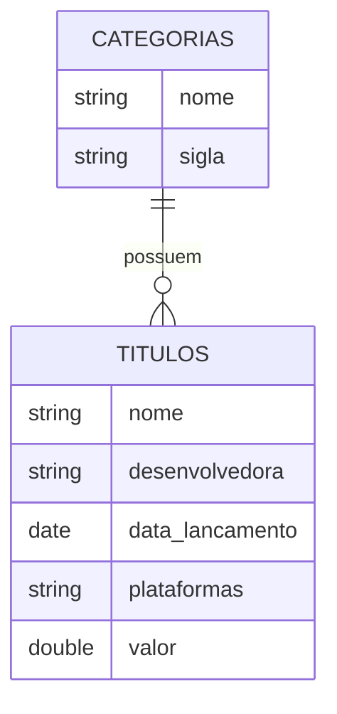
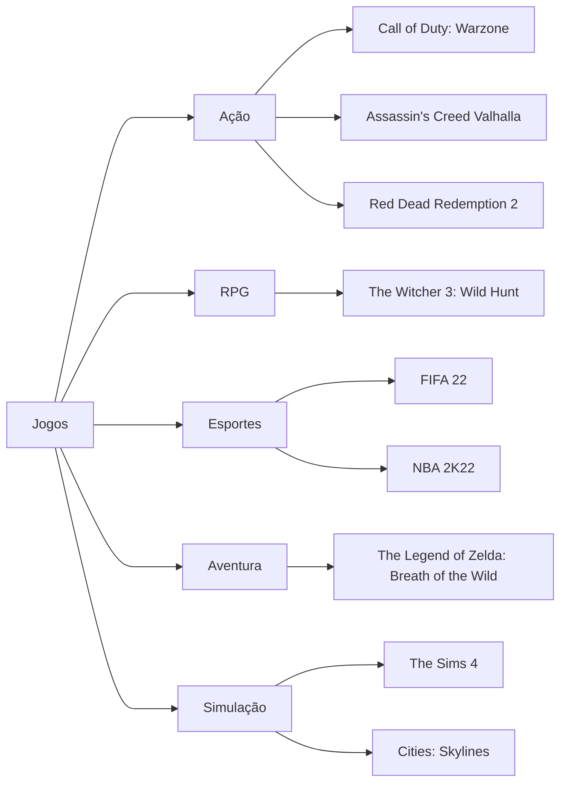

# Vamos organizar uma categoria de jogos

## Contexto

Estamos organizando uma forma de representar a relação entre categorias de jogos e seus correspondentes itens. Optamos por utilizar uma estratégia de documento incorporado para representar essa relação, já que podemos ter a seguinte relação de dependência entre eles:





## Criação da coleção incorporada

Primeiro, crie um banco de dados chamado `jogos`:

```javascript
use jogos;
```

:::note
No NoSQLBooster você deve utilizar o menu de contexto para criação do banco jogos.
No mesmo menu de contexto, você deve uma sessão de comandos.
:::


## Criação da coleção CATEGORIAS

```javascript
db.createCollection("categorias", {
  validator: {
    $jsonSchema: {
      bsonType: "object",
      required: ["sigla", "nome", "titulos"],
      properties: {
        sigla: {
          bsonType: "string",
          description: "Deve ser uma string representando a sigla da categoria com no máximo 5 caracteres.",
          maxLength: 5
        },
        nome: {
          bsonType: "string",
          description: "Deve ser uma string representando o nome da categoria."
        },
        titulos: {
          bsonType: "array",
          description: "Deve ser uma matriz de títulos de jogos relacionados à categoria.",
          items: {
            bsonType: "object",
            required: ["nome", "desenvolvedora", "data_lancamento", "plataformas", "valor"],
            properties: {
              nome: {
                bsonType: "string",
                description: "Deve ser uma string representando o nome do jogo."
              },
              desenvolvedora: {
                bsonType: "string",
                description: "Deve ser uma string representando a desenvolvedora do jogo."
              },
              data_lancamento: {
                bsonType: "date",
                description: "Deve ser uma data no formato ISODate representando a data de lançamento do jogo."
              },
              plataformas: {
                bsonType: "array",
                description: "Deve ser uma matriz de plataformas em que o jogo está disponível.",
                items: {
                  bsonType: "string",
                  description: "Deve ser uma das plataformas aceitáveis (PlayStation, XBox, PC).",
                  enum: ["PlayStation", "XBox", "PC", "Nintendo Switch"]
                }
              },
              valor: {
                bsonType: "double",
                description: "Deve ser um número de ponto flutuante representando o valor do jogo.",
                minimum: 0.01
              }
            }
          }
        }
      }
    }
  }
});
```


## Inserindo nossos dados

```javascript
db.categorias.insertMany([
  {
    "sigla": "AC",
    "nome": "Ação",
    "titulos": [
      {
        "nome": "Call of Duty: Warzone",
        "desenvolvedora": "Infinity Ward",
        "data_lancamento": ISODate("2020-03-10T00:00:00Z"),
        "plataformas": ["PlayStation", "XBox"],
        "valor": 59.99
      },
      {
        "nome": "Assassin's Creed Valhalla",
        "desenvolvedora": "Ubisoft",
        "data_lancamento": ISODate("2020-11-10T00:00:00Z"),
        "plataformas": ["PC", "PlayStation", "XBox"],
        "valor": 49.99
      },
      {
        "nome": "Red Dead Redemption 2",
        "desenvolvedora": "Rockstar Games",
        "data_lancamento": ISODate("2018-10-26T00:00:00Z"),
        "plataformas": ["PlayStation", "XBox"],
        "valor": 39.99
      }
    ]
  },
  {
    "sigla": "RPG",
    "nome": "RPG",
    "titulos": [
      {
        "nome": "The Witcher 3: Wild Hunt",
        "desenvolvedora": "CD Projekt Red",
        "data_lancamento": ISODate("2015-05-19T00:00:00Z"),
        "plataformas": ["PC", "PlayStation", "XBox"],
        "valor": 29.99
      }
    ]
  },
  {
    "sigla": "ES",
    "nome": "Esportes",
    "titulos": [
      {
        "nome": "FIFA 22",
        "desenvolvedora": "EA Sports",
        "data_lancamento": ISODate("2021-10-01T00:00:00Z"),
        "plataformas": ["PlayStation", "XBox", "PC"],
        "valor": 49.99
      },
      {
        "nome": "NBA 2K22",
        "desenvolvedora": "2K Sports",
        "data_lancamento": ISODate("2021-09-10T00:00:00Z"),
        "plataformas": ["PlayStation", "XBox", "PC"],
        "valor": 49.99
      }
    ]
  },
  {
    "sigla": "ADV",
    "nome": "Aventura",
    "titulos": [
      {
        "nome": "The Legend of Zelda: Breath of the Wild",
        "desenvolvedora": "Nintendo",
        "data_lancamento": ISODate("2017-03-03T00:00:00Z"),
        "plataformas": ["Nintendo Switch"],
        "valor": 49.99
      }
    ]
  },
  {
    "sigla": "SIM",
    "nome": "Simulação",
    "titulos": [
      {
        "nome": "The Sims 4",
        "desenvolvedora": "Maxis",
        "data_lancamento": ISODate("2014-09-02T00:00:00Z"),
        "plataformas": ["PC"],
        "valor": 19.99
      },
      {
        "nome": "Cities: Skylines",
        "desenvolvedora": "Paradox Interactive",
        "data_lancamento": ISODate("2015-03-10T00:00:00Z"),
        "plataformas": ["PC", "PlayStation", "XBox"],
        "valor": 29.99
      }
    ]
  }
]);
```