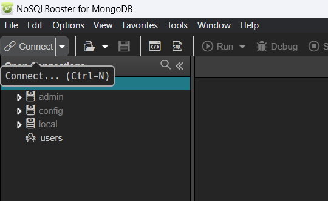
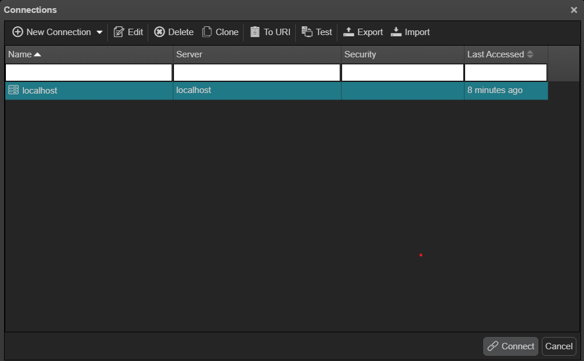

# Recuperar todos os setores que têm um nome com mais de 10 caracteres

## Processo de desenvolvimento da atividades

### Criação das coleções no MongoDB

Caso você não tenha criado as coleções do tópico anterir, execute o procedimento a seguir:

<details>
<summary>Procedimento para criação da estrutura</summary>

Para subir o MongoDB:

```bash
mongod --dbpath c:\data\db
```

Com o utilitário [NoSQLBooster](https://nosqlbooster.com/), crie uma nova conexão do tipo localhost.





Crie um novo banco chamado empresa e execute o seguinte código (`Somente se não existir`)

```javascript title="Criacao do validator"
db.createCollection("setores", {
   validator: {
      $jsonSchema: {
         bsonType: "object",
         required: ["_id", "nome", "sigla", "funcionarios"],
         properties: {
            _id: {
               bsonType: "int",
               description: "ID único do setor"
            },
            nome: {
               bsonType: "string",
               description: "Nome do setor"
            },
            sigla: {
               bsonType: "string",
               description: "Sigla do setor",
               minLength: 2,
               maxLength: 5
            },
            funcionarios: {
               bsonType: "array",
               description: "Array de funcionários",
               items: {
                  bsonType: "object",
                  required: ["_id", "nome", "cargo", "modulo", "salario", "dataContratacao", "ativo"],
                  properties: {
                     _id: {
                        bsonType: "int",
                        description: "ID único do funcionário"
                     },
                     nome: {
                        bsonType: "string",
                        description: "Nome do funcionário"
                     },
                     cargo: {
                        bsonType: "string",
                        description: "Cargo do funcionário"
                     },
                     modulo: {
                        bsonType: "int",
                        description: "Módulo do funcionário",
                        minimum: 0,
                        maximum: 5
                     },
                     salario: {
                        bsonType: "double",
                        description: "Salário do funcionário"
                     },
                     dataContratacao: {
                        bsonType: "date",
                        description: "Data de contratação do funcionário"
                     },
                     ativo: {
                        bsonType: "bool",
                        description: "Indica se o funcionário está ativo"
                     }
                  }
               }
            }
         }
      }
    }
});
```

Agora é o momento de inserir os dados da coleção recém criada:

```javascript title="Dados da coleção"
db.setores.insertMany([
    {
        _id: 1,
        nome: "Recursos Humanos",
        sigla: "RH",
        funcionarios: [
            {
                _id: 1,
                nome: "Amanda Oliveira Santanna",
                cargo: "Analista de Recursos Humanos",
                modulo: 1,
                salario: 5034.45,
                dataContratacao: new ISODate("2020-05-18"),
                ativo: true,
            },
            {
                _id: 2,
                nome: "Anderson Campos Monteiro",
                cargo: "Analista de Recursos Humanos",
                modulo: 3,
                salario: 12311.26,
                dataContratacao: new ISODate("2011-10-01"),
                ativo: false
            },        
        ]
    },
    {
        _id: 2,
        nome: "Marketing",
        sigla: "MKT",
        funcionarios: [
            {
                _id: 3,
                nome: "Washington Marcondes Nunes",
                cargo: "Analista de Marketing",
                modulo: 1,
                salario: 6436.41,
                dataContratacao: new ISODate("2015-06-12"),
                ativo: true
            },
            {
                _id: 4,
                nome: "Bruna Correia da Fonseca",
                cargo: "Analista de Marketing",
                modulo: 2,
                salario: 8122.13,
                dataContratacao: new ISODate("2013-05-30"),
                ativo: true
            },        
        ]
    },
	{
		_id: 3,
		nome: "Tecnologia e Engenharia",
		sigla: "GTE",
		funcionarios: [
			{
				_id: 5,
				nome: "Pedro Antunes Silva Barros",
				cargo: "Estagiário",
				modulo: 0,
				salario: Double(2200.00),
				dataContratacao: new ISODate("2021-10-21"),
				ativo: true
			},
			{            
				_id: 6,
				nome: "Caroline Gouvea do Prado",
				cargo: "Desenvolvedor FullStack",
				modulo: 4,
				salario: 18246.78,
				dataContratacao: new ISODate("2011-02-01"),
				ativo: true
			},
			{          
				_id: 7,  
				nome: "Alisson Mendonça Pereira",
				cargo: "Analista de DevOps",
				modulo: 2,
				salario: 8451.89,
				dataContratacao: new ISODate("2018-07-07"),
				ativo: true
			},
		]
	}
]);
```
</details>

### Uma possível solução para o exercício 1

Uma abordagem para a solução seria utilizar o mecanismo de busca do MongoDB `find` sobre a nossa coleção. Retornar apenas as entradas onde o campo nome é maior do que 10:

```javascript
db.setores.find({
    $expr: { $gt: [{ $strLenCP: "$nome" }, 10] }
});
```

<details>
<summary>Utilizando o método de pipeline para obter o mesmo resultado</summary>

```javascript title="Busca por aggregate"
db.setores.aggregate([
  {
    $match: {
      $expr: { $gt: [{ $strLenCP: "$nome" }, 10] }
    }
  }
]);
```
</details>

:::info
Também é possível combinar operadores para identificar um intervalo. 
Por exemplo, caso o exercício solicite um intervalo entre 10 e 20 caracteres poderíamos utilizar a seguinte consulta.

```javascript
db.setores.find({
      $expr: { 
          $and: [
            { $gte: [{ $strLenCP: "$nome" }, 10] }, 
            { $lte: [{ $strLenCP: "$nome" }, 20] }
          ]
      }
  });
```
:::