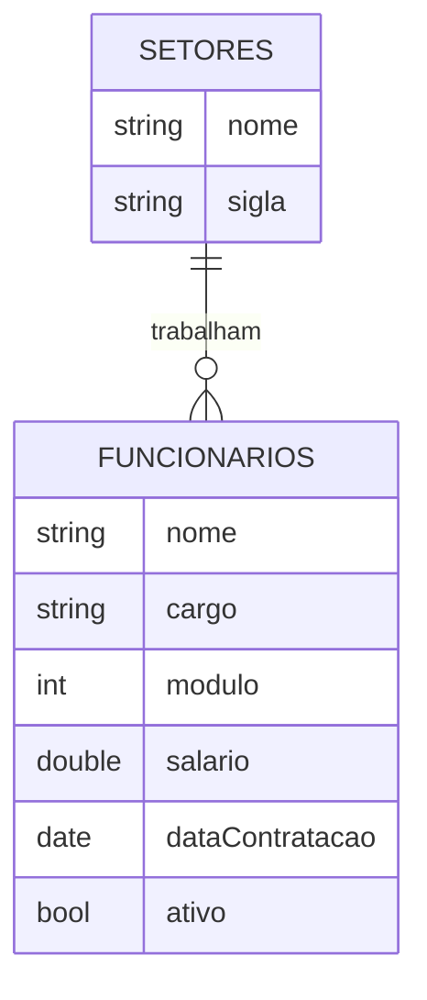
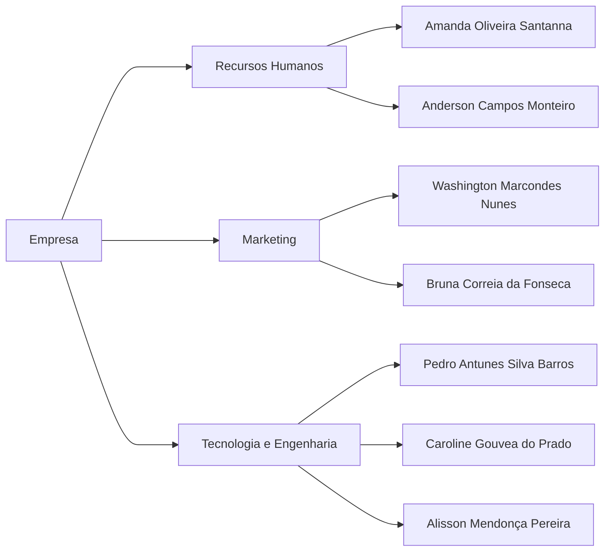

# Relacionmento Um para Muitos em MongoDB

No MongoDB, você pode representar relacionamentos "um para muitos" (1:N) usando documentos incorporados (embedded documents) em um único documento pai. Vamos dar um exemplo de como você pode modelar um relacionamento "um para muitos" usando documentos incorporados no MongoDB.


## Um exemplo de uso: Relação setores e funcionarios

Suponha que você esteja gerenciando informações sobre setores de uma corporação e seus funcionarios associados. Cada setor pode ter vários funcionários, o que se encaixa no cenário "um setor tem muitos funcionários" (1:N). Você pode representar isso da seguinte forma:





## O tipo de documento incorporado

No MongoDB, o tipo "embedded document" (documento incorporado) refere-se a um método de modelagem de dados em que documentos inteiros são incorporados como campos em outro documento. Essa é uma das abordagens para modelar relacionamentos de dados no MongoDB, onde os dados relacionados são armazenados dentro do documento pai em vez de criar coleções separadas com referências cruzadas.

Aqui estão algumas informações importantes sobre documentos incorporados no MongoDB:


- Documentos Aninhados: Os documentos incorporados são frequentemente referidos como "documentos aninhados". Eles são usados para representar dados relacionados dentro de um único documento.

- Vantagens:

   - **Desempenho**: A recuperação de dados relacionados é eficiente, pois todos os dados necessários estão em um único documento, reduzindo a necessidade de várias consultas.
   - **Integridade Referencial**: Não há necessidade de lidar com referências cruzadas ou manter consistência entre documentos em coleções separadas.
   - **Atomicidade**: As operações de leitura e gravação em documentos incorporados são atomicamente garantidas.

- Desvantagens:

   - **Duplicação de Dados**: Os dados podem ser duplicados em vários documentos, o que pode aumentar o consumo de armazenamento. Isso também significa que, se os dados precisarem ser atualizados em vários lugares, é necessário cuidado extra para manter a consistência.
   - **Limitação de Tamanho**: Os documentos no MongoDB têm um limite de tamanho (16 MB). Se a quantidade de dados incorporados for grande, isso pode ser uma limitação.

Quando Usar Documentos Incorporados:

- Use documentos incorporados quando os dados relacionados são usados principalmente em conjunto e a leitura eficiente desses dados é fundamental.
Pode ser apropriado em cenários "um para muitos" (1:N) e "um para poucos" (1:Few) quando os "muitos" ou "poucos" não são excessivamente numerosos.
Quando Evitar Documentos Incorporados:

- Evite documentos incorporados quando os dados relacionados são usados independentemente ou precisam ser atualizados em várias instâncias, o que pode tornar a manutenção mais complexa.
A escolha entre documentos incorporados e referências cruzadas depende das necessidades específicas do seu aplicativo. O MongoDB oferece flexibilidade para modelar dados de acordo com os requisitos do seu caso de uso, permitindo que você escolha a abordagem mais adequada para cada tipo de relação.


## Representação simplificada do modelo em json

```json
{
    setor,
    funcionarios: [

    ]
}
```

## Criação da estrutura em MongoDB

Execute o procedimento de subida da instância e conecte a nova base:

```json
use empresa;
```

Agora é o momento de criar a estrutura da coleção:

```json
db.createCollection("setores", {
   validator: {
      $jsonSchema: {
         bsonType: "object",
         required: ["_id", "nome", "sigla", "funcionarios"],
         properties: {
            _id: {
               bsonType: "int",
               description: "ID único do setor"
            },
            nome: {
               bsonType: "string",
               description: "Nome do setor"
            },
            sigla: {
               bsonType: "string",
               description: "Sigla do setor",
               minLength: 3,
               maxLength: 5
            },
            funcionarios: {
               bsonType: "array",
               description: "Array de funcionários",
               items: {
                  bsonType: "object",
                  required: ["_id", "nome", "cargo", "modulo", "salario", "dataContratacao", "ativo"],
                  properties: {
                     _id: {
                        bsonType: "int",
                        description: "ID único do funcionário"
                     },
                     nome: {
                        bsonType: "string",
                        description: "Nome do funcionário"
                     },
                     cargo: {
                        bsonType: "string",
                        description: "Cargo do funcionário"
                     },
                     modulo: {
                        bsonType: "int",
                        description: "Módulo do funcionário",
                        minimum: 0,
                        maximum: 5
                     },
                     salario: {
                        bsonType: "double",
                        description: "Salário do funcionário"
                     },
                     dataContratacao: {
                        bsonType: "date",
                        description: "Data de contratação do funcionário"
                     },
                     ativo: {
                        bsonType: "bool",
                        description: "Indica se o funcionário está ativo"
                     }
                  }
               }
            }
         }
      }
   }
});
```

## Inserindo os primeiros dados em nossa coleção

```json
db.setores.insertMany([
    {
        _id: 1,
        nome: "Recursos Humanos",
        sigla: "RH",
        funcionarios: [
            {
                _id: 1,
                nome: "Amanda Oliveira Santanna",
                cargo: "Analista de Recursos Humanos",
                modulo: 1,
                salario: 5034.45,
                dataContratacao: new ISODate("2020-05-18"),
                ativo: true,
            },
            {
                _id: 2,
                nome: "Anderson Campos Monteiro",
                cargo: "Analista de Recursos Humanos",
                modulo: 3,
                salario: 12311.26,
                dataContratacao: new ISODate("2011-10-01"),
                ativo: false
            },        
        ]
    },
    {
        _id: 2,
        nome: "Marketing",
        sigla: "MKT",
        funcionarios: [
            {
                _id: 3,
                nome: "Washington Marcondes Nunes",
                cargo: "Analista de Marketing",
                modulo: 1,
                salario: 6436.41,
                dataContratacao: new ISODate("2015-06-12"),
                ativo: true
            },
            {
                _id: 4,
                nome: "Bruna Correia da Fonseca",
                cargo: "Analista de Marketing",
                modulo: 2,
                salario: 8122.13,
                dataContratacao: new ISODate("2013-05-30"),
                ativo: true
            },        
        ]
    }
]);
```

## Ajustando a regra de validação

Ao tentar inserir dados na coleção, é possível identificar que a sigla RH não atende o critério de tamanho do campo.

Não existe uma maneira de aplicar um update no schema validator, mas é possível removê-lo e incluí-lo nomvanete:

```json
db.runCommand({
    collMod: "setores",
    validator: {
      $jsonSchema: {
         bsonType: "object",
         required: ["_id", "nome", "sigla", "funcionarios"],
         properties: {
            _id: {
               bsonType: "int",
               description: "ID único do setor"
            },
            nome: {
               bsonType: "string",
               description: "Nome do setor"
            },
            sigla: {
               bsonType: "string",
               description: "Sigla do setor",
               minLength: 2,
               maxLength: 5
            },
            funcionarios: {
               bsonType: "array",
               description: "Array de funcionários",
               items: {
                  bsonType: "object",
                  required: ["_id", "nome", "cargo", "modulo", "salario", "dataContratacao", "ativo"],
                  properties: {
                     _id: {
                        bsonType: "int",
                        description: "ID único do funcionário"
                     },
                     nome: {
                        bsonType: "string",
                        description: "Nome do funcionário"
                     },
                     cargo: {
                        bsonType: "string",
                        description: "Cargo do funcionário"
                     },
                     modulo: {
                        bsonType: "int",
                        description: "Módulo do funcionário",
                        minimum: 0,
                        maximum: 5
                     },
                     salario: {
                        bsonType: "double",
                        description: "Salário do funcionário"
                     },
                     dataContratacao: {
                        bsonType: "date",
                        description: "Data de contratação do funcionário"
                     },
                     ativo: {
                        bsonType: "bool",
                        description: "Indica se o funcionário está ativo"
                     }
                  }
               }
            }
         }
      }
    }
});
```

## Agora é como você

Aplique os ajustes necessários para inserir o seguinte documento na coleção de `setores`:

```json
{
    nome: "Tecnologia e Engenharia",
    sigla: "GTE",
    funcionarios: [
        {
            nome: "Pedro Antunes Silva Barros",
            cargo: "Estagiário",
            modulo: 0,
            salario: 2200.00,
            dataContratacao: "21/10/2021",
            ativo: true
        },
        {            
            nome: "Caroline Gouvea do Prado",
            cargo: "Desenvolvedor FullStack",
            modulo: "4",
            salario: "18246.78",
            dataContratacao: "01/02/2011",
            ativo: true
        },
        {            
            nome: "Alisson Mendonça Pereira",
            cargo: "Analista de DevOps",
            modulo: "2",
            salario: "8451.89",
            dataContratacao: "07/07/2018",
            ativo: true
        },
    ]
}
```